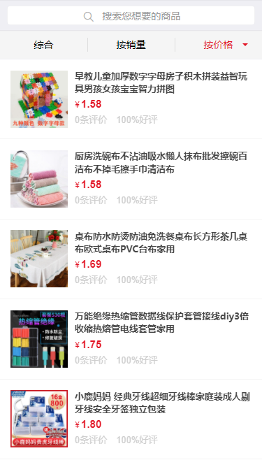

# thinkphp5购物商城

#### 介绍
用tp5开发一个购物商城，从简单到复杂





#### 软件架构
基于thinkphp5开发，环境可以用lnmp或者lamp

#### 安装教程

1.  下载源码
2.  解压源码
3.  虚拟域名指向public（宝塔需要将运行目录指向public）
4.  创建数据库，导入sql（config下面的bs_shop.sql)数据
5.  访问域名（xxxx.com）访问
6.  伪静态设置（参考thinkphp）,下面是nginx配置：
```nginx
location / { 
   if (!-e $request_filename) {
   rewrite  ^(.*)$  /index.php?s=/$1  last;
   break;
    }
 }
```
 


#### 使用说明

1.  适用单商户
2.  支持购物车
3.  支持批量下单
4.  支持商品收藏、交易等


#### 特技

1. 用简单的方式实现一个thinkphp
2. 基于js编写前端逻辑，后期可以自己改成vue等，目前是前后分离模式
