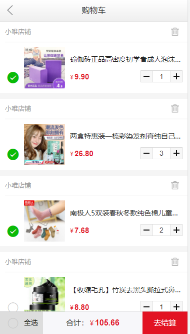
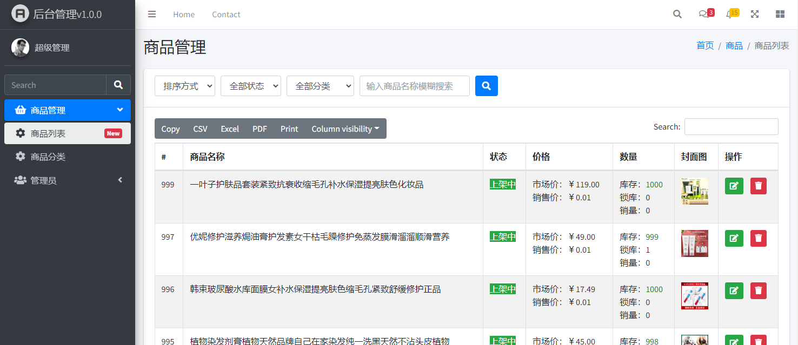

# thinkphp5购物商城

#### 介绍
用tp5开发一个购物商城，从简单到复杂，商品、搜索、购物车、订单、收藏、充值、交易记录等，  **用最简单的方式写商城，会点php和jq的都可以维护二开** 。

后台功能：商品管理、分类管理、权限菜单、权限管理、管理员管理、角色管理、轮播管理、导航管理、订单管理等。

这是一个适合个人和企业使用的中小型商城，可以自定义扩展和二开。

###### 在线体验(注册自动有1000体验余额): [http://demo.bs.shop.wei1.top/](http://demo.bs.shop.wei1.top/) 

后台(部分功能)：http://demo.bs.shop.wei1.top/admin/


###### 运行效果





角色管理


商品管理


#### 接口文档
客户端（商城端）的接口文档在doc目录的html里面，直接打开即可。
生成：用apidoc的@0.19.1生成，tpl为生成模板（已自定义样式）

#### 软件架构
基于thinkphp5开发，环境可以用lnmp或者lamp

#### 安装教程

1. 下载源码

   github：<a href="https://github.com/brisk21/shopping-mall">https://github.com/brisk21/shopping-mall</a>
   
   gitee：<a href="https://gitee.com/brisklan/thinkphp5-shopping-mall">https://gitee.com/brisklan/thinkphp5-shopping-mall</a>

2. 解压源码

3. 虚拟域名指向public（宝塔需要将运行目录指向public）

4. 创建数据库，导入sql（install目录下面的bs_shop.sql有demo数据，另外一个仅结构)数据

5.  伪静态设置（参考thinkphp）,下面是nginx配置：
```nginx


location / { 
   if (!-e $request_filename) {
   rewrite  ^(.*)$  /index.php?s=/$1  last;
   break;
    }
 }
```
6.访问域名（xxxx.com）访问（后台访问xxxx.com/admin/）


#### 使用说明

1.  适用单商户
2.  支持购物车
3.  支持批量下单
4.  支持商品收藏、交易等


#### 特技

1. 用简单的方式实现一个thinkphp
2. 基于js编写前端逻辑，后期可以自己改成vue等，目前是前后分离模式

#### 交流群
群2（过期请加微信交流：wei1-top）：


###### 基于这个开发的一个返利版（建议在微信下直接授权登录）：[返利版demo](https://wx.wei1.top/union/store.user/index.html)
这是MVC模式，已上线使用。


